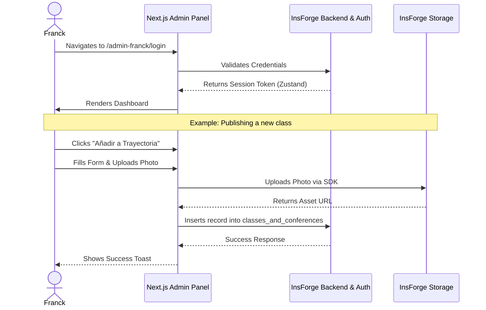

# Sitemap & User Flows: Franck Bietry Portfolio

## 1. Global Sitemap (Architecture)
The site is divided into a Read-Only public facing area (optimized for SEO and UX) and a protected Administrative dashboard.

```mermaid
graph TD
    %% Public Routes
    Root((Root Domain)) --> Home[/ "/ (Home & Profile)" /]
    Root --> Journey[/ "/parcour (Journey/Chronology)" /]
    Root --> Pubs[/ "/publicaciones (Academic Archives)" /]
    Root --> Blog[/ "/blog (Articles)" /]

    %% Admin Routes
    Root -.-> Login[/ "/admin-franck/login" /]
    Login --"Authenticates via InsForge"--> Dashboard[/ "/admin-franck/dashboard" /]
    
    Dashboard --> ManagePubs[/ "/admin-franck/publicaciones" /]
    Dashboard --> ManageJourney[/ "/admin-franck/parcour" /]
    Dashboard --> ManageBlog[/ "/admin-franck/blog" /]
    Dashboard --> Settings[/ "/admin-franck/settings" /]
```

## 2. Core User Flows

### Flow A: The "Recruiter / Dean" Journey (Public Profile Discovery)
This flow ensures that when someone searches "Franck Bietry", they land on a highly optimized, visually stunning page that immediately communicates his authority.

```mermaid
journey
    title Public User Journey: Discovering Franck's Authority
    section 1. First Impression
      Lands on Home (SEO #1 Google): 5: User
      Views Glassmorphism Profile Card: 5: User
      Reads Short Bio & Current Roles: 4: User
      Observes Infinite Logo Carousel (Institutions): 5: User
    section 2. Deep Dive (The Parcour)
      Clicks "Mi Trayectoria / Parcour": 4: User
      Scrolls Chronological Timeline (Classes/Conferences): 5: User
      Triggers Framer Motion 3D Glass reveals: 5: User
    section 3. Academic Validation
      Clicks "Publicaciones": 4: User
      Filters by Year/Category: 4: User
      Clicks CTA "Read Paper" (External link/PDF): 5: User
```

### Flow B: The "Franck" Journey (Content Management)
A zero-friction administrative experience. Franck does not want to write code or deal with complex CMS systems; he wants to drop content and publish.



## 3. UI Navigation Specifications
*   **Desktop**: Floating glass Navbar (sticky at top). Links: *Inicio, Trayectoria, Publicaciones, Blog*.
*   **Mobile**: Bottom navigation bar (App-like feel) or a minimalist top-right hamburger menu opening a full-screen blurred glass overlay.
