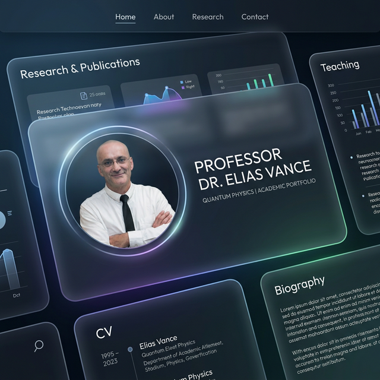
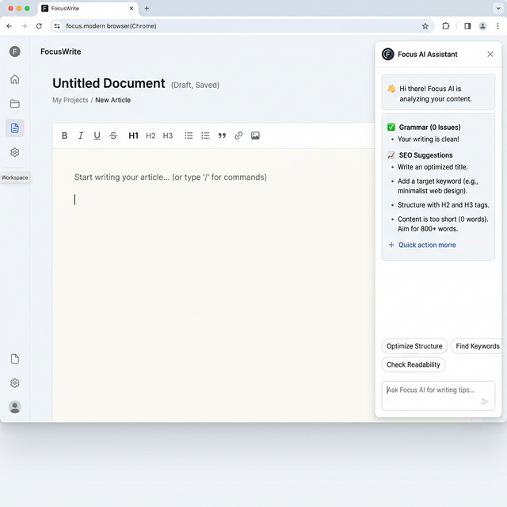

# Vision Générale et Expérience Utilisateur : Portfolio de Franck Bietry

Ceci est la boussole conceptuelle de notre projet. Nous décrivons ici, en langage naturel, ce que nous construisons, pour qui c'est destiné, la sensation de son utilisation et l'impact final que nous recherchons.

## 1. Que créons-nous et pour qui ?

Nous construisons l'"identité numérique maîtresse" de **Franck Bietry**, un professeur d'université et chercheur de premier plan. Plus qu'un simple blog, c'est un Portfolio Académique de très haut niveau.

Ce site n'est pas conçu pour le grand public ; son public cible est très spécifique :
*   **Les Académiques et Chercheurs** : Ils recherchent un accès rapide et clair à ses articles, revues et publications.
*   **Les Étudiants** : Ils ont besoin de trouver des informations sur ses cours ou des ressources.
*   **Les Doyens et Recruteurs** : Ils visiteront le site pour valider son autorité, son parcours de carrière et vérifier dans quelles institutions il a collaboré.

## 2. L'Interface Publique (Ce que voient les visiteurs)

Lorsque quelqu'un cherche "Franck Bietry" sur Google, l'objectif est que le site soit indexé à **100 % en 1ère position** grâce à notre SEO rigoureux et à des schémas de données structurées (JSON-LD).

Le visiteur entrera dans une expérience que nous définissons comme le **"Glassmorphism Innovant" (Verre et Glace)** :

*   **L'Esthétique** : Ce ne sera pas l'arrière-plan blanc ennuyeux typique. L'arrière-plan aura des tons subtils ou des dégradés élégants inspirés de la glace, ou des thèmes très sombres et sobres. Au-dessus flotteront des conteneurs (cartes et menus) qui ressemblent à du verre dépoli (`backdrop-blur`). Derrière le verre, tout sera légèrement flou, créant une sensation de profondeur et de 3D, accentuée par des ombres claires autour des éléments. La typographie subtile sera parfaitement lisible.
*   **L'Accueil (Home)** : La première chose qu'ils verront sera une présentation impeccable de qui est Franck. Tout son poids professionnel en un coup d'œil, couronné en bas par un carrousel horizontal défilant doucement, affichant les logos de toutes les prestigieuses institutions avec lesquelles il a travaillé.
*   **Son Parcours (Parcour)** : Une section visuellement exquise où le visiteur descend sur l'écran et où se révèlent magiquement (avec de douces transitions 3D animées par Framer Motion) les événements, cours et années charnières de sa carrière.
*   **Publications et Blog** : Conçues pour une lisibilité maximale. Visuellement épurées, de grands textes (utilisant la police premium Phosphor Icons) et des boutons clairs pour télécharger les PDF ou lire la suite sans distractions.

## 3. L'Interface Privée (L'Assistant de Franck)

La vraie magie du site ne réside pas seulement dans le design "Glassmorphism", mais dans la façon dont Franck le gère. 

Nous avons abandonné les systèmes préhistoriques comme WordPress. Nous créons pour Franck la route sécurisée `/admin-franck`, protégée par son mot de passe. Une fois à l'intérieur, c'est l'expérience "zéro friction" :

*   **Éditeur Visuel Minimaliste** : Franck ne verra pas de panneaux complexes, ni d'options de plugins confuses. Il fera face à une page blanche (style Notion). Il commence simplement à taper. S'il veut ajouter une photo : il la glisse depuis son bureau vers son navigateur et le système (InsForge) l'héberge automatiquement sans qu'il ait à toucher un seul code.
*   **L'Agent d'Intelligence Artificielle (Le Co-Pilote)** : Il ne sera pas seul. Sur le côté droit, il aura un chat intégré directement dans l'éditeur, propulsé par **Gemini 3.0** de Google. 
    *   Si Franck écrit un article rapide, il peut dire à l'IA : *"Corrige mon orthographe, donne-lui un ton académique et optimise-le pour le terme SEO 'Leadership Universitaire'"*. 
    *   L'IA lira l'écran et lui fournira le texte peaufiné.
    *   L'éditeur est un **assistant exécutant** : Franck peut cliquer sur "Accepter les suggestions", et l'IA appliquera le style et écrira automatiquement ces corrections dans le document par elle-même.

## 4. Conclusion 

Nous construisons une voiture de sport de luxe, sans aucun frais d'entretien pour le client (grâce au niveau gratuit de la plateforme InsForge), avec le tout enveloppé dans la technologie de pointe Next.js et Hero UI. Les visiteurs perçoivent le prestige et l'innovation visuelle. Franck expérimente un minimalisme pur avec l'assistance d'une IA de pointe. C'est un site rapide, visuellement impressionnant et capable de s'éditer lui-même.
